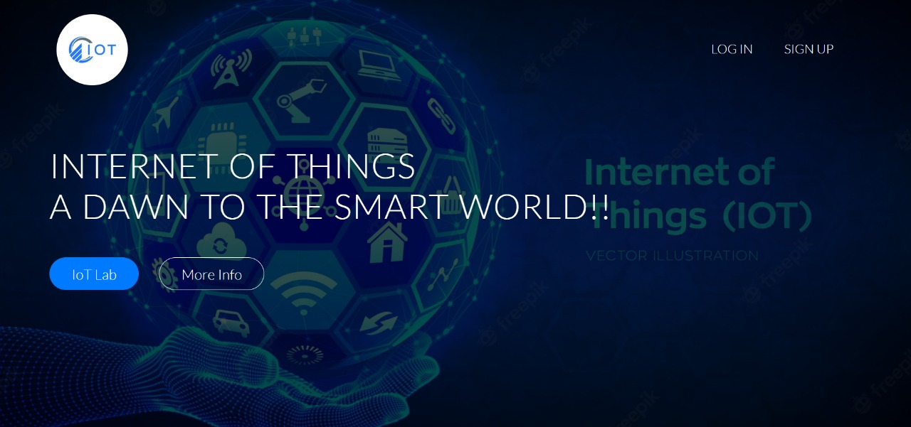
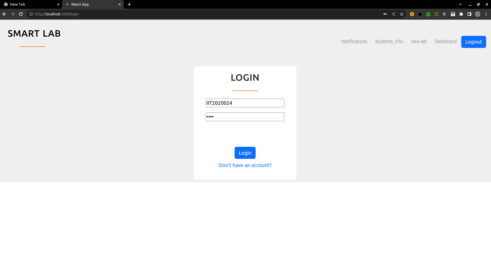
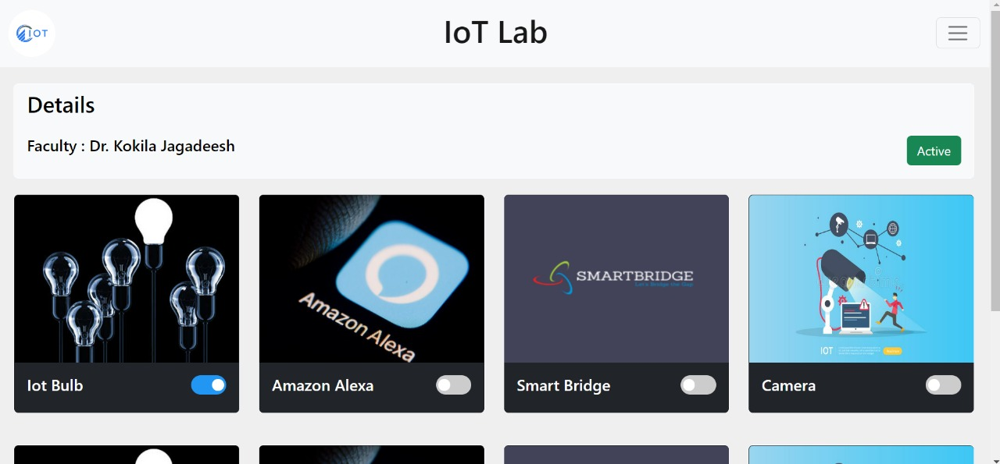
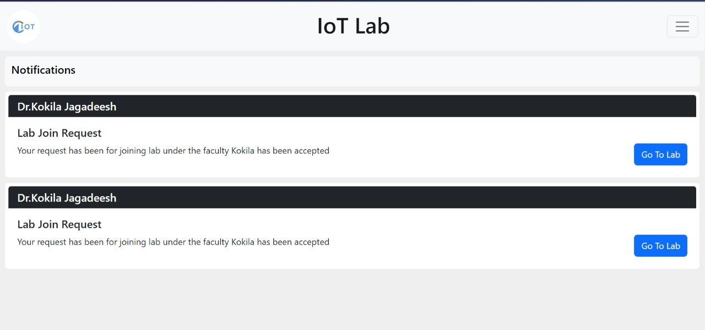
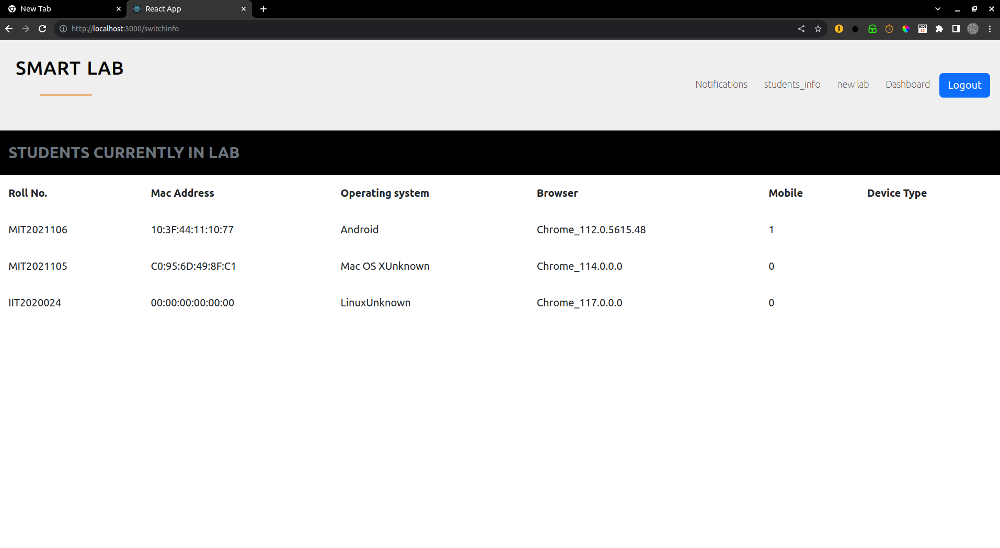

# About this project
This is a React.js based project in a team of 4 to provide students with mobile access to electrical devices in the lab, which significantly improved student experience.
Students can ask for access to a lab to a faculty. Faculty can provide and deny access to the lab.
Faculty can monitor students present in the lab.
In the case of a potential Man-in-the-Middle attack, the student may receive a notification on their email.

# Features of project

#### home screen

#### login screen

#### lab details

#### request screen

#### bulb in off state

#### bulb in on state

#### student details

